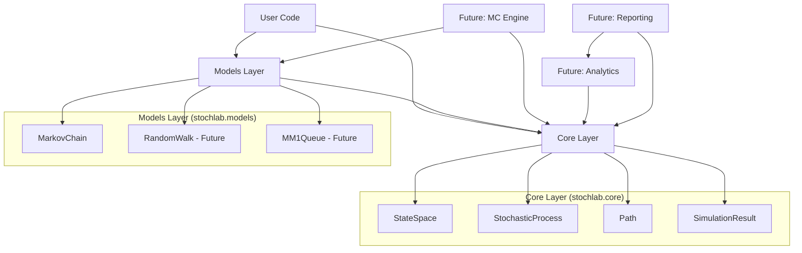
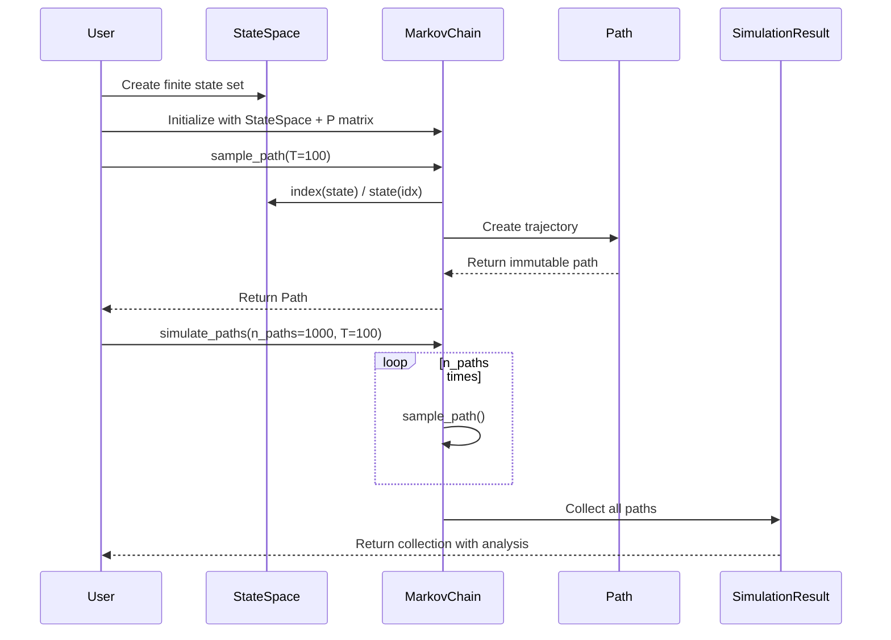
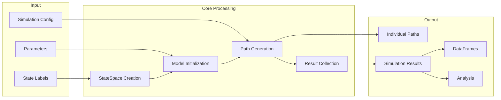

# Architecture Overview

## Design Philosophy

stochlab follows a **layered architecture** that separates concerns and enables extensibility:

## Module Interactions

### Core Components Flow

## Layer Responsibilities

### Core Layer (`stochlab.core`)
**Purpose**: Fundamental abstractions used by all models

- **StateSpace**: Finite state set with bijective label ↔ index mapping
- **StochasticProcess**: Abstract interface all models must implement
- **Path**: Single trajectory with validation and immutability
- **SimulationResult**: Collection of paths with analysis methods

**Dependencies**: Only numpy, pandas
**Rules**: No model-specific logic, no I/O, no plotting

### Models Layer (`stochlab.models`)
**Purpose**: Concrete stochastic process implementations

- **MarkovChain**: Time-homogeneous finite Markov chains
- *Future*: RandomWalk, MM1Queue, GaltonWatsonProcess

**Dependencies**: Core layer + numpy for mathematical operations
**Rules**: Must implement StochasticProcess interface

### Future Layers

#### Monte Carlo Engine (`stochlab.mc`)
**Purpose**: Advanced simulation capabilities
- Variance reduction techniques
- Parallel processing
- Seeding strategies

#### Analytics (`stochlab.analytics`)
**Purpose**: Analytical solutions and numerical methods
- Stationary distributions
- Hitting times
- Queueing metrics

#### Reporting (`stochlab.reporting`)
**Purpose**: Visualization and data export
- Interactive plots
- DataFrame utilities
- Export formats

## Data Flow Architecture

## Key Design Patterns

### Immutability Strategy
- **StateSpace**: Completely immutable (`frozen=True`)
- **Path**: Mutable container with immutable arrays
- **SimulationResult**: Mutable collection of immutable paths

### Validation Boundaries
- Input validation at object creation (`__post_init__`)
- Type checking with comprehensive hints
- Mathematical validation (stochastic matrices, probability distributions)

### Interface Contracts
- **State = Hashable**: Any hashable type can be a state
- **StochasticProcess**: Abstract base requiring `state_space` and `sample_path()`
- **Path indexing**: `path[i]` returns state at time i

## Extension Points

### Adding New Models
1. Inherit from `StochasticProcess`
2. Implement required abstract methods
3. Add comprehensive validation
4. Include thorough tests

### Adding Analytics
1. Create pure functions in `analytics/` module
2. Accept core objects as inputs
3. Return mathematical results
4. No side effects or global state

### Adding Visualization
1. Create functions in `reporting/` module
2. Accept `SimulationResult` or DataFrames
3. Return plot objects or save files
4. Optional dependencies for plotting libraries